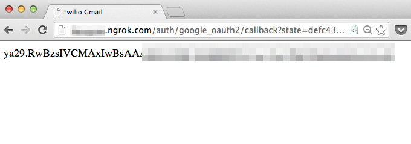

Send SMS email alerts with the Gmail API and Ruby on Rails
================================

I turned off Gmail alerts on my phone. I get so many emails that it just doesn't make sense for me to hear a beep every time a new one shows up. However, there are some emails that I would like to get alerts for. In this tutorial we're going to to send SMS alerts using Ruby on Rails, GMail API, and Twilio. 

## Setup the GMail API and OAuth Credentials

First thing we need to do is to head over to the [Google Developer's Console](https://console.developers.google.com/project) and create a new project. Once this completes, click into your project, lick "Enable an API", and flip the toggles next to the *Gmail API*, *Google Contacts CardDAV API*, and *Google+ API* to *ON*. 


Next we need to create our OAuth2 credentials. On the left hand side of the screen, click *Credentials*, then click *Create new Client ID*. For development purposes, I suggest signing up for ngrok and using a customized subdomain as your callback url. 


Once you click *Create Client ID*, you're going to see some new values pop up on your dashboard. Drop into a terminal and set these values as session variables (later on, make sure you launch the rails server from this same terminal window). 

```term
export CLIENT_ID=123456789.apps.googleusercontent.com
export CLIENT_SECRET=abcdefg
```


## Ruby on Rails, Google API, and Omniauth

Now let's create a new rails app and set it up to work with Omniauth and the Google API gem. 

Create a new Rails app. 

```term
rails new gmail-twilio
cd gmail-twilio
```

This final version of our app won't use any views, so we can strip out a lot of the standard gems. Replace your ```Gemfile``` with this: 

```ruby
source 'https://rubygems.org'

gem 'rails', '4.0.2'
gem 'sqlite3'
gem 'google-api-client', require: 'google/api_client'
gem 'omniauth', '~> 1.2.2'
gem 'omniauth-google-oauth2'
gem 'json'
```

If you use [rvm](https://rvm.io/) or [rbenv](https://github.com/sstephenson/rbenv), set your ruby version and gemset: 

```term
echo "2.1.2" > .ruby-version
echo "gmail-twilio" > .ruby-gemset
```

and then install your gems: 

```term 
gem install bundler
bundle install
```

Let's talk about a few of those gems we just installed: 

#### google-api-client

This is the ruby gem provided by Google to access Google APIs. Google didn't quite conform to the traditional way we name and package gems, so if we simply use ```gem 'google-api-client'```, we'll get an ```uninitialized constant``` error when we later try to call ```Google::APIClient.new```. To prevent this, we append the ```require: 'google/api_client'```. 

##### Omniauth

OmniAuth uses swappable “strategies” allow us to authorize with the Google API via OAuth2.0. Fortunately, there's a Omniauth strategy for the Google API. Create a new file in ```config/initializers``` called ```omniauth.rb```. 


```ruby
#config/initalizers/omniauth.rb
Rails.application.config.middleware.use OmniAuth::Builder do
  provider :google_oauth2, ENV['CLIENT_ID'], ENV['CLIENT_SECRET'], {
    access_type: 'offline',
    scope: ['https://www.googleapis.com/auth/userinfo.email',
            'https://www.googleapis.com/auth/gmail.readonly']
  }
end
```

What does all this mean? 

The ```provider``` line tells Omniauth to use the google_oauth2 strategy with the environment variables we set earlier. ```access_type: 'offline' tells Google that we would like to have access to the Gmail API when we are away from the browser. After we initially authorize our GMail account, Google will send us back a token that we can store to make future requests. 

```
scope
```

tells Google which APIs we would like to have access to. You might think that you would only need to access the Gmail scope, however if we omit the ```userinfo.email``` scope, we will receive an ```insufficientPermissions``` error when we try to authenticate.

### The Callback

The way this is going to work is: 

1. We visit an authorization URL 
2. Our app redirects us to Google to authorize the use of our Gmail account
3. Once authorized, Google "calls back" our app and sends along an authorization token.

Replace your ```routes.rb``` file with this: 

```ruby
Gmail::Application.routes.draw do
  get "/auth/:provider/callback" => "sessions#create"
end
```

And create a new file at ```apps/controllers/sessions_controller.rb```

```ruby
class SessionsController < ApplicationController
  def create
    @auth = request.env["omniauth.auth"]
    @token = @auth["credentials"]["token"]
  end
end
```

And for some instant gratification, we'll create a view to display the fruits of our labor: 

```
# app/views/sessions/create.erb
<%= @token %>
```

Back in your terminal, start rails: 

```term
rails s
```

Then visit your ```http://yourngroksubdomain.ngrok.com/auth/google_oauth2```. You will be forwarded to a screen you've seen many times before: 


And once you authorize your account, you will see your OAuth token: 



# Store the token

Let's create a simple model in which to store our token so that we don't have to authenticate our account every time we want to use the GMail API. In the terminal: 

```term
rails g model token \auth_token:string
rake db:migrate
```

And then we'll add this line to our ```SessionsController```: 

```ruby
Token.create(auth_token: @token)
```

We could do some more advanced token management, but for the purpose of this tutorial, we'll create a new token record everytime we get one and always use the most recent. 

# Retrieve messages with the GMail API

Now that Google knows that we have permission to access our GMail account, let's do something with that permission. 

