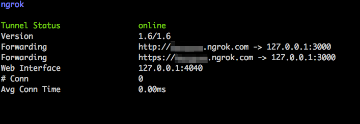
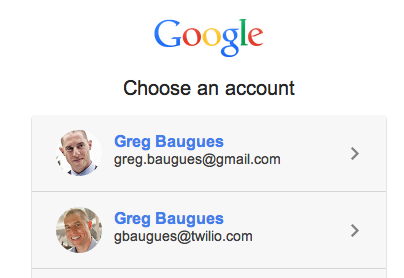
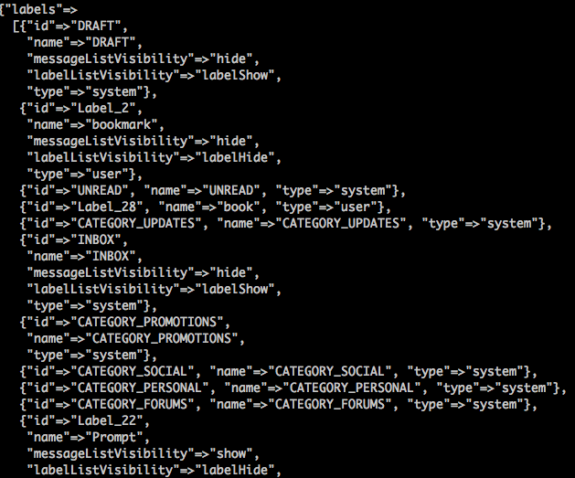
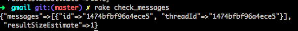
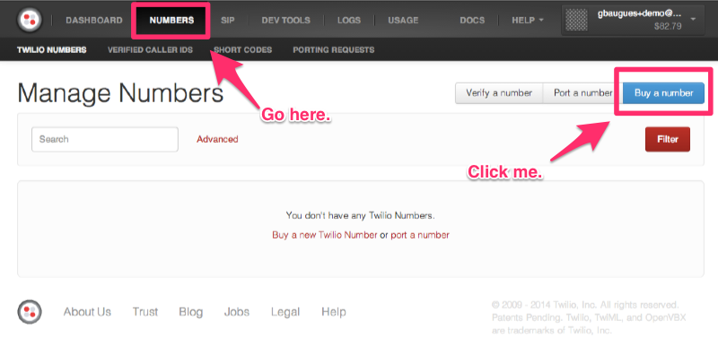
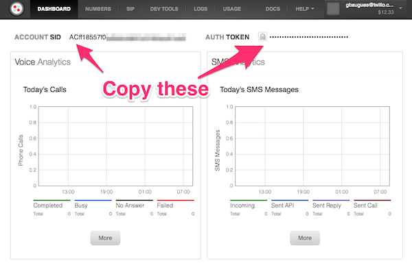

Send SMS email alerts with the Gmail API and Ruby on Rails
================================

I turned off Gmail alerts on my phone. I get so many emails that it just doesn't make sense for me to hear a beep every time a new one shows up. However, there are some emails that I would like to get alerts for. In this tutorial we're going to to send SMS alerts using Ruby on Rails, GMail API, and Twilio. 

# Create Gmail Filter to add SMS label to messages

# Setup ngrok

We need our rails server have a public available URL so that both Google OAuth and Twilio can send data to it. At Twilio, we're big fans of ngrok to create a tunnel from our local machine to the outside Internet. 

[Download ngrok](https://ngrok.com/), unzip it, then move the executable to your home directory. [Register for a free account](https://ngrok.com/user/signup) so that you can use custom subdomains. Then we'll run ngrok, using the custom domain option (I'll use ```example```), and we'll pass in the port number of our (not yet created) Rails app -- 3000 by default. 

Assuming the default downloads folder on OSX, this process looks like this: 

```
unzip ~/Downloads/ngrok.zip
mv ~/Downloads/ngrok ~
~/ngrok -subdoman=example 3000
```

Once it ngrok starts up, you should see something like this. Leave this terminal window open and ngrok running while you're developing this app. 



## Setup the GMail API and OAuth Credentials

Head over to the [Google Developer's Console](https://console.developers.google.com/project) and create a new project. Once this completes, click into your project, click "Enable an API", and flip the toggles next to the *Gmail API*, *Google Contacts CardDAV API*, and *Google+ API* to *ON*. 


Next we need to create our OAuth2 credentials. On the left hand side of the screen, click *Credentials*, then click *Create new Client ID*. For development purposes, I suggest signing up for ngrok and using a customized subdomain as your callback url. 


Once you click *Create Client ID*, you're going to see some new values pop up on your dashboard. Drop into a terminal and set these values as session variables (later on, make sure you launch the rails server from this same terminal window. You may also want to use [dotenv](https://github.com/bkeepers/dotenv) to store your configuration variables in a file that is loaded with rails so that you don't have to reset these every time you start a terminal session.) 

```shell
export CLIENT_ID=123456789.apps.googleusercontent.com
export CLIENT_SECRET=abcdefg
```


## Ruby on Rails, Google API, and Omniauth

Now let's create a new rails app and set it up to work with Omniauth and the Google API gem. 

Create a new Rails app. 

```shell
rails new gmail-twilio
cd gmail-twilio
```

This final version of our app won't use any views, so we can strip out a lot of the standard gems. Replace your ```Gemfile``` with this: 

```ruby
source 'https://rubygems.org'

gem 'rails', '4.0.2'
gem 'sqlite3'
gem 'google-api-client', require: 'google/api_client'
gem 'omniauth', '~> 1.2.2'
gem 'omniauth-google-oauth2'
gem 'json'
```

If you use [rvm](https://rvm.io/) or [rbenv](https://github.com/sstephenson/rbenv), set your ruby version and gemset: 

```shell
echo "2.1.2" > .ruby-version
echo "gmail-twilio" > .ruby-gemset
```

and then install your gems: 

```shell 
gem install bundler
bundle install
```

Let's talk about a few of those gems we just installed: 

#### google-api-client

This is the ruby gem provided by Google to access Google APIs. Google didn't quite conform to the traditional way we name and package gems, so if we simply use ```gem 'google-api-client'```, we'll get an ```uninitialized constant``` error when we later try to call ```Google::APIClient.new```. To prevent this, we append the ```require: 'google/api_client'```. 

##### Omniauth

OmniAuth uses swappable “strategies” allow us to authorize with the Google API via OAuth2.0. Fortunately, there's a Omniauth strategy for the Google API. Create a new file in ```config/initializers``` called ```omniauth.rb```. 


```ruby
#config/initalizers/omniauth.rb
Rails.application.config.middleware.use OmniAuth::Builder do
  provider :google_oauth2, ENV['CLIENT_ID'], ENV['CLIENT_SECRET'], {
    access_type: 'offline',
    scope: ['https://www.googleapis.com/auth/userinfo.email',
            'https://www.googleapis.com/auth/gmail.readonly']
  }
end
```

What does all this mean? 

The ```provider``` line tells Omniauth to use the google_oauth2 strategy with the environment variables we set earlier. ```access_type: 'offline' tells Google that we would like to have access to the Gmail API when we are away from the browser. After we initially authorize our GMail account, Google will send us back a token that we can store to make future requests. 

*scope* tells Google which APIs we would like access to. You might think that you would only need to access the Gmail scope, however if we omit the ```userinfo.email``` scope, we will receive an ```insufficientPermissions``` error when we try to authenticate.

## The Callback

The way this is going to work is: 

1. We visit an authorization URL 
2. Our app redirects us to Google to authorize the use of our Gmail account
3. Once authorized, Google "calls back" our app and sends along an authorization token.

Replace your ```routes.rb``` file with this: 

```ruby
Gmail::Application.routes.draw do
  get "/auth/:provider/callback" => "sessions#create"
end
```

And create a new file at ```apps/controllers/sessions_controller.rb```

```ruby
class SessionsController < ApplicationController
  def create
    @auth = request.env["omniauth.auth"]
  end
end
```

And for some instant gratification, we'll create a view to display the fruits of our labor: 

```
# app/views/sessions/create.erb
<%= @auth %>
```

Back in your terminal, start rails: 

```shell
rails s
```

Then visit your ```http://yourngroksubdomain.ngrok.com/auth/google_oauth2```. You will be forwarded to a screen you've seen many times before: 



And once you authorize your account, you will see the data passed back from Google. Of most interest is what's stored at the ```credentials``` key in the hash. 

## Store the token

Let's create a model in which to store our token so that we don't have to authenticate our account every time we want to use the GMail API. In the terminal: 

```shell
rails g model token \token:string refresh_token:string expires_at:datetime
rake db:migrate
```

The access token Google issues is only good for 60 minutes. Once it expires, we have to request a new token using the ```refresh_token``` passed along the first time we authenticate our Google account. Unfortunately, the google-api-gem doesn't have a built in method to refresh a token, so we'lll have write that ourselves using ```net/http```, ```json```, and the docs for [how to refresh a Google API token](https://developers.google.com/accounts/docs/OAuth2WebServer#refresh). At the end we'll add a convenience method to return the most recent access token, refreshing if necessary. 


```ruby
require 'net/http'
require 'json'

class Token < ActiveRecord::Base

  def refresh!
    data = JSON.parse(request_token_from_google.body)
    update_attributes(
      token: data['access_token'],
      expires_at: Time.now + (data['expires_in'].to_i).seconds
    )
  end

  def request_token_from_google
    url = URI("https://accounts.google.com/o/oauth2/token")
    Net::HTTP.post_form(url, self.to_params)
  end

  def to_params
    { 'refresh_token' => refresh_token,
      'client_id'     => ENV['CLIENT_ID'],
      'client_secret' => ENV['CLIENT_SECRET'],
      'grant_type'    => 'refresh_token'}
  end

  def self.access_token
    #convenience method to retrieve the latest token and refresh if necessary
    t = Token.last
    t.refresh! if t.expires_at < Time.now
    t.token
  end

```

Now update our ```SessionsController``` 

```ruby
class SessionsController < ApplicationController
  def create
    @auth = request.env["omniauth.auth"]["credentials"]
    Token.create(@auth)
      token:          @auth['token'],
      refresh_token:  @auth['refresh_token'],
      expires_at:     @auth['expires_at'])
  end
end
```

So now we are able to authorize our GMail account and refresh the token automatically when it expires. Now let's use it to pull date from the GMail API. 

## Retrieve labels from the GMail API

Let's create a rake task to get a list of all our labels so that we can find the ID of the 'sms' label we created. 

Let's get a list of all the labels. We'll need to find the ID of our 'sms' label so that we can use it to filter the list of messages later we pull from GMail:  

```ruby
#lib/tasks/list_labels.rake
task :list_labels  => :environment  do
  require 'pp'

  client = Google::APIClient.new
  client.authorization.access_token = Token.access_token
  service = client.discovered_api('gmail')
  result = client.execute(
      :api_method => service.users.labels.list,
      :parameters => {'userId' => 'me'},
      :headers => {'Content-Type' => 'application/json'})
  pp JSON.parse(result.body)
end  
```

Run this task from the terminal: 

```shell
rake list_labels
```



My SMS labelId is 'Label_29', so that's what I'll use in the rest of the article. Change yours accordingly. 

## Retrieve Messages from the Gmail API

Create a new task file called ```check_messages.rb``` and copy/paste the list_labels code. With a few small changes to our labels task we can retrieve messages:

1. Change the task name from ```list_labels``` to ```check_messages```
2. Change the ```:api_method``` to ```service.users.messages.list```
3. add to the ```:parameters``` hash ```'labelIds' => ['INBOX', 'Label_29']``` 

```ruby
# lib/tasks/check_messages.rb
task :check_messages  => :environment  do
  client = Google::APIClient.new
  client.authorization.access_token = Token.access_token
  service = client.discovered_api('gmail')
  result = client.execute(
      :api_method => service.users.messages.list,
      :parameters => {'userId' => 'me', 'labelIds' => ['INBOX', 'Label_29']},
      :headers => {'Content-Type' => 'application/json'})
  messages = JSON.parse(result.body)
  pp messages
end
```



You can see that I have a single message in my Inbox with the SMS tag. We're going to need a way to track these messages. We're going to need to pull out the subject line, figure out who sent them and keep track of which messages we've sent SMSs. In short, we're going to need a Message model. 

## Create Messages Model

```shell
rails g model Message gmail_id:string from:string subject:string 
```

## Retrieve an individual message
* extract the subject, from 
* validate gmail_id is unique
* save

## Setup Twilio Account

Sign into your Twilio account or [create a free Twilio account](https://www.twilio.com/try-twilio) if you don't have one already. 



From your account Dashboard, click ```Numbers``` and search for a phone number. Once you find one that suits your fancy, buy it, then click ```Setup Number```. Now go back to your [account dashboard](https://www.twilio.com/user/account) and find your ```account_sid``` and ```auth_token```. 



Save these values as session variables in the same way that you did for the Google OAuth credentials. (You'll need to stop your Rails server and do this from the same terminal window as before... or use dotenv). 

```shell
export MY_CELLPHONE=+13126207892
export TWILIO_PHONE_NUMBER=+13128675309
export TWILIO_ACCOUNT_SID=ABCDEFGHI
export TWILIO_AUTH_TOKEN=12345679
```

## Add Twilio method to the Message model

```ruby
after_create :send_sms

def send_sms
  client = Twilio::REST::Client.new ENV['TWILIO_ACCOUNT_SID'], ENV['TWILIO_AUTH_TOKEN']
  client.messages.create(
    to: ENV['MY_CELLPHONE'], 
    from: ENV['TWILIO_PHONE_NUMBER'], 
    body: "#{from} -- #{subject}"
  )
end
```

## Update Check Messages Task


```ruby
messages.each do |msg|
  data = Message.retrieve(msg['id'])
  ...
end

```

## Create Cron job

```term
5 * * * rake check_messages
```

# All done!
